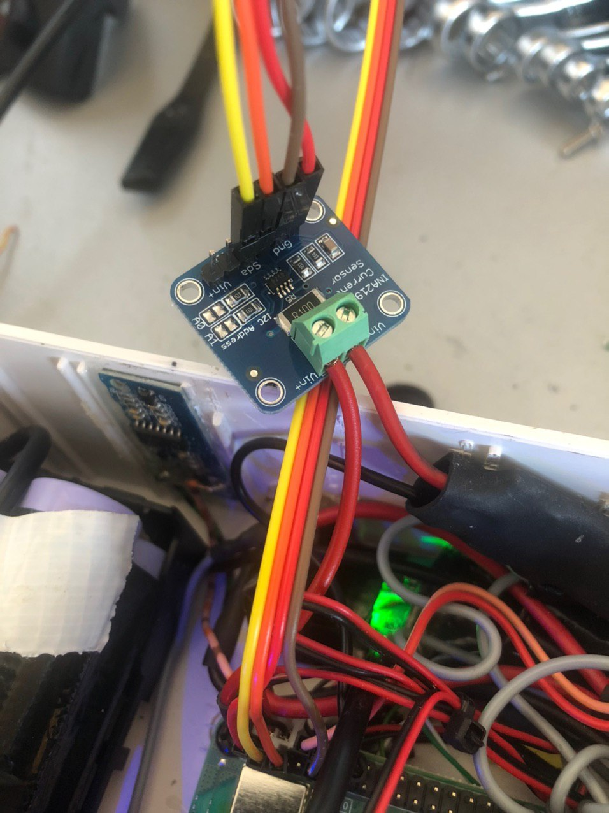

# Getting Started

When a project reaches a certain stage, the amount of options to choose from can get pretty overwhelming. This section of the documentation is intended to help guide newcomers to the project towards their first functional Open.HD implementation. 


If you have a pre-existing hardware requirement that is not met in this guide, it is still a good idea to follow the guide and make sure you have this, the simplest setup, working before venturing into the more complex setups. Every setup, no matter how complex uses the elements in this guide at it's base.


## Sourcing hardware

Assuming you are starting with nothing, we recommend you get the following hardware:

* A Raspberry Pi4B for the Ground SBC
* A Raspberry Pi3A+ or Raspberry Pi Zero for the Air SBC
* Two WiFi cards that support the band you want to use. \(See [WiFi Adapters](../hardware/wifi-adapters.md)\)
* An HDMI cable for connecting the Ground SBC to a screen
* An HDMI capable screen \(use your TV for testing!\)
* A mobile device capable of running QOpen.HD and connecting to the Ground SBC
* Two BEC's for powering the Air and Ground SBC's. \(See Wiring -&gt; Power\)
* Various lengths of connection wires.
* A soldering iron and required disposables.

## Step-by-step

Now that you have your prerequisite hard- and software, we can get down to business.

### Step 1: Powering the Ground SBC

This is where the ESC's come in. Much like the Air SBC, the Ground SBC will likely be powered by a LiPo battery. The Raspberry Pi and the WiFi cards all use 5V, which is what most ESC's produce. So hook up one of your SBC's to a LiPo battery and use a multimeter to double-check the output is +5V.


The Raspberry Pi and most WiFi adapters actually like the voltage to be slightly higher than +5V, along the lines of 5.2V ~ 5.4V. If you have a variable output, best set it to +5.3V. Do not go higher than +5.4V or you will damage your Raspberry Pi and/or WiFi cards!


When you have verified the output of the ESC, we can connect it to the Raspberry Pi, to do this, we have two options. Soldering or using the GPIO Pin Header, for the Ground SBC it's OK to use the GPIO Pin Header, for the Air unit we recommend soldering. Connect the output from the ESC to the PI on pins 2 and 6 \(or 4 and 6\) according to this diagram:

This can be done easily by just plugging in the Servo header that comes with most ESC's into the Raspberry Pi Pin Header. Make sure the RED wire is connecting to Pin 2 or 4 and the BLACK wire is connecting to PIN 6. Now when you connect power to the ESC, the Raspberry Pi will power up!


For all following steps, make sure to disconnect the power before attaching anything to the Raspberry Pi unless explicitly stated.


### Step 2: Connecting the WiFi Adapter

Now that we have power going to the Raspberry Pi it's time to complicate things. Attaching WiFi cards should be as easy as plugging them into the Pi's USB ports, unfortunately it isn't. Due to the way the Raspberry Pi is designed the USB ports do not receive enough power to drive the WiFi cards, especially when connecting more than one WiFi card as is often the case on a ground station.

So we need to make sure we provide enough power to the WiFi card while still attaching it to the Raspberry Pi's USB port. There are several ways to do this, including using a USB HUB and powering that from the ESC. Take a look at [Wiring](../hardware/wiring.md) for inspiration. For this step-by-step we will create an modified USB cable.

TODO: Pics of cable assembly, is this really the least tricky way? Perhaps cheap USB HUB + Hack would be easier? Do not solder to PI warning!


While it may seem tempting to solder the +5V and GND to the solder points on the Raspberry Pi, doing so is not OK! We will be feeding +5V into the circuit of the Pi where this is not intended, probably destroying the USB controller. Make sure the +5V wire of the USB cable is no longer connected on the Pi side. GND is OK connected or unconnected to the Pi.


### Step 3: Connecting a display

For this step-by-step we will just connect a display to the HDMI port, any TV or monitor with HDMI in will be useable. Bear in mind that bringing your 85" flatscreen TV to the field might be impractical. So for a more portable setup use a small HDMI capabable monitor or use the 7" Raspberry Pi Touch Screen and create the ultimate GCS. \(See examples [here](https://discuss.openhdfpv.com/c/custom-tx-aio/9)\)

### Step 4: Starting the Ground SBC for the first time

Now that we have everything connected to the Ground SBC, it's time to plug in the power. 


When bench-testing you can use a bench power supply instead of a LiPo to prevent draining the LiPo, but make sure it can supply the required Amps, when using a LiPo, connect a LiPo warning device to prevent over-discharging!


### Step 5: Connecting QOpenHD to the Ground SBC

TODO

